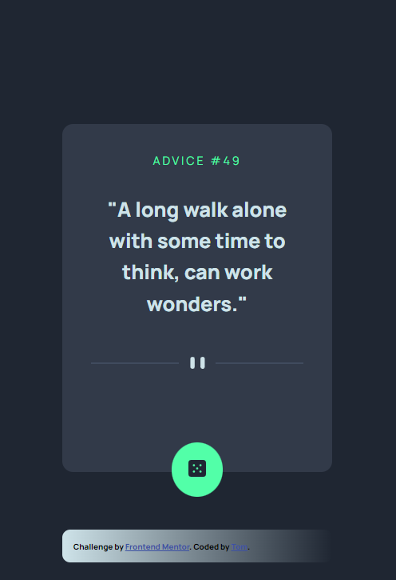
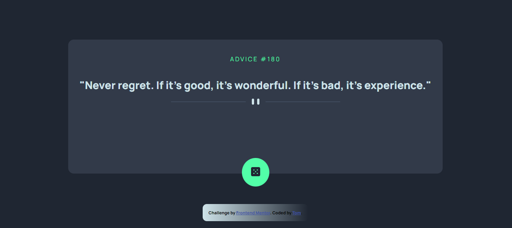

# Frontend Mentor - Advice generator app solution

> This is a solution to the [Advice generator app challenge on Frontend Mentor](https://www.frontendmentor.io/challenges/advice-generator-app-QdUG-13db).

## Table of contents

- [Overview](#overview)
  - [The challenge](#the-challenge)
  - [Screenshots](#screenshots)
  - [Links and useful resources](#links-and-useful-resources)
- [My process](#my-process)
  - [Built with...](#built-with)
  - [What I learned](#what-i-learned)
  - [Open questions and problems](#open-questions-and-problems)
  - [Continued development](#continued-development)
- [Author](#author)
<!-- - [Acknowledgments](#acknowledgments) -->

## Overview

### The challenge

> Users should be able to:
>
> - View the optimal layout for the app depending on their device's screen size
> - See hover states for all interactive elements on the page
> - Generate a new piece of advice by clicking the dice icon

### Screenshots

  


### Links and useful resources

- w3schools: [HTML SVG Graphics](https://www.w3schools.com/html/html5_svg.asp)
- w3schools: [SVG \<path>](https://www.w3schools.com/graphics/svg_path.asp)
- DEV Community: [Fetch API Series Series' Articles](https://dev.to/silvenleaf/series/15546)
- MDN: [Third-party APIs](https://developer.mozilla.org/en-US/docs/Learn/JavaScript/Client-side_web_APIs/Third_party_APIs)

## My process

### Built with...

- Semantic HTML5 markup
- CSS custom properties
- Flexbox
- Desktop first media query
- Google Fonts API
- Fetch API
- Advice Slip JSON API: [api.adviceslip.com](https://api.adviceslip.com/)

### What I learned

_CSS breakpoints:_

```css
@media only screen and (max-width: 600px) {
  #advice-container {
    width: 400px;
    color: red;
  }
}
```

_Luminize button:_

```css
#next:hover {
  cursor: pointer;
  box-shadow: 0 0 60px 15px hsl(150, 100%, 66%);
}
```

### Open questions and problems

_I don't know why the `.attribution` container does not grow to 1440px:_

```css
.attribution {
  max-width: 1440px;
  [...]
  padding: 15px;
  background: linear-gradient(to right, [...]));
}
```

```css
@media only screen and (max-width: 700px) {
  #advice-container,
  .attribution {
    width: 375px;
  }
}
```

### Continued development

I want to continue working on further functionality from the [_Advice Slip JSON API_](https://api.adviceslip.com/):

- Get random advice
- Select advice by ID
- Search advice by search term
- Get daily advice by RSS feed

## Author

- Github - [@TomUlrich](https://github.com/TomUlrich)

<!-- ## Acknowledgments

This is where you can give a hat tip to anyone who helped you out on this project. Perhaps you worked in a team or got some inspiration from someone else's solution. This is the perfect place to give them some credit. -->
